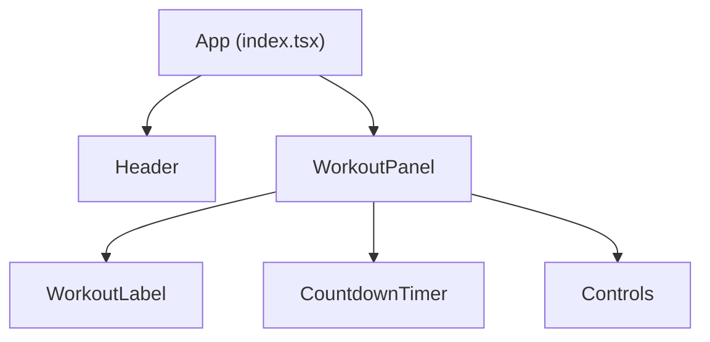

# 7 Minutes Workout App – Implementation Plan

## 1. Component Structure

## 2. State Management

- **workouts**: Static array of `{ label, duration }`
- **currentIndex**: Index of current workout
- **isRunning**: Boolean for timer state
- **timeLeft**: Seconds remaining for current step

## 3. UI/UX Flow

- User lands on workout page ([`src/routes/index.tsx`](src/routes/index.tsx:1))
- Sees current workout label, timer, and controls (Start, Pause, Next, Previous)
- Timer counts down and auto-advances to next step
- Responsive, mobile-friendly layout

## 4. Tech Stack

- React functional components, hooks
- Tailwind v4 for styling
- shadcn/ui for buttons and layout

## 5. Implementation Steps

1. Define static workout sequence in [`src/routes/index.tsx`](src/routes/index.tsx:1)
2. Create `WorkoutPanel` component with:
   - `WorkoutLabel` (current workout name)
   - `CountdownTimer` (time left)
   - `Controls` (Start, Pause, Next, Previous)
3. Implement timer logic with auto-advance
4. Style with Tailwind and shadcn/ui components
5. Ensure responsive design
